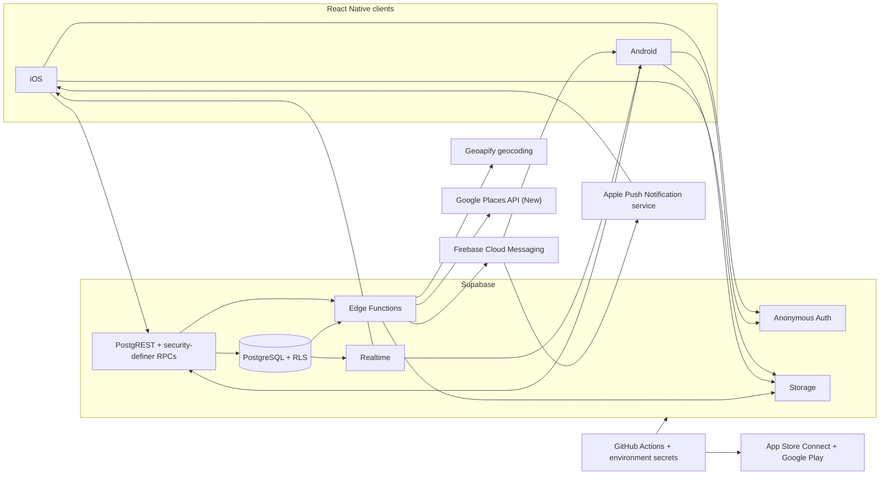

# Choosr

Choosr is a private, real-time decision app for iOS and Android. Two people
review the same choices independently, rank the options they accepted, and
reveal the strongest shared result only after both have finished.

The product removes the coordination overhead from everyday decisions:

- **Activity** — meet halfway and choose from five nearby things to do.
- **Food** — meet halfway and choose from five nearby restaurants.
- **Custom** — compare private text choices, uploaded photos, or both.

Choosr also provides reusable Circles, room invitations, resumable active
rooms, an in-app notification inbox, native push notifications, and
cross-device media. Development, UAT, and production are isolated native apps
with separate cloud configuration and release pipelines.

The top-level Choosr Home also opens **Choosr Chat**, an isolated two-person
conversation entered through a single-use private link or in-person QR. It
uses temporary device keys, end-to-end encrypted messages,
participant-controlled destruction, and automatic 24-hour expiry. The existing
decision experience remains available through **Choose Together**.

> **Release status:** Choosr is available through App Store Connect/TestFlight
> and Google Play testing tracks. It has not been released publicly.

## What makes the product different

Choosr Choose is not a public poll or a chat thread. Each participant makes a
complete, private decision before the result is calculated:

1. Both people receive the same five-card deck in the same stored order.
2. Each person swipes every card left or right.
3. Accepted cards are ranked privately:
   - one to three accepted cards: rank all of them;
   - four or five accepted cards: rank the top three.
4. After both rankings are submitted, only mutually accepted cards remain.
5. The database selects the strongest shared result by combined rank score,
   then worst individual rank. An exact tie uses a deterministic,
   room-specific tiebreak so neither person nor card order is favored.
6. If there is no overlap, Choosr returns a private no-match result.

No participant can inspect the other person's swipes or rankings before the
result. The authoritative match is computed in PostgreSQL, not on either
device.

For Activity and Food rooms, Choosr accepts validated participant locations
only when they are within 60 miles of each other, computes their midpoint, and
stores one shared five-card deck. Activity discovery uses a strict Google
Places primary-type allowlist and rejects lodging, campgrounds, associations,
and other non-activity businesses.

## End-to-end architecture



### Runtime responsibilities

| Layer          | Technology                                    | Responsibility                                                               |
| -------------- | --------------------------------------------- | ---------------------------------------------------------------------------- |
| Mobile         | React Native 0.86, React 19, TypeScript       | Shared product UI and domain behavior                                        |
| Native iOS     | Xcode schemes, Firebase Messaging, APNs       | Environment identity, signing, push, badges                                  |
| Native Android | Gradle product flavors, Firebase Messaging    | Environment identity, signing, push                                          |
| Navigation/UI  | React Navigation, Reanimated, Gesture Handler | Typed flows and swipe interaction                                            |
| Identity       | Supabase anonymous authentication             | Frictionless user identity without collecting credentials                    |
| Data           | PostgreSQL, Row Level Security, Realtime      | Authoritative rooms, participants, rankings, matches, Circles, notifications |
| Mutations      | PostgreSQL security-definer RPCs              | Atomic, validated state transitions                                          |
| Server logic   | Supabase Edge Functions                       | Place discovery, location search, image caching, push dispatch               |
| Media          | Supabase Storage                              | Decision photos, profile photos, and cached venue images                     |
| Location       | Geoapify                                      | Authenticated city/ZIP autocomplete and geocoding                            |
| Discovery      | Google Places API (New)                       | Nearby activities/restaurants, ratings, reviews, photos, map links           |
| Push           | Firebase Cloud Messaging + APNs               | Android and iOS background delivery                                          |
| Delivery       | GitHub Actions                                | Tests, migrations, signed builds, and store uploads                          |

The mobile applications contain only environment-safe Supabase publishable
configuration. Provider keys, service accounts, database credentials, signing
material, and store credentials are stored in protected GitHub environments
and materialized only inside CI or the target server environment.

## Core product flows

### Shared local Activity and Food rooms

Location rooms are intentionally generated only after both participants join:

```text
Creator selects mode and location
  -> room and invitation are created
  -> invitee joins and supplies a location
  -> backend calculates the geographic midpoint
  -> Google Places is searched at 5, 10, then 20 miles as needed
  -> candidates are scored and reduced to five
  -> deck is shuffled once, persisted, and activated
  -> both participants swipe the identical deck
```

The search pipeline:

- accepts a validated U.S. or Canadian city/ZIP suggestion;
- keeps participant coordinates private and scoped to the room;
- uses a spherical midpoint so one person is not favored;
- uses a curated activity allowlist and excludes campgrounds, RV parks,
  associations, and other low-quality categories;
- scores candidates using rating, review volume, photo availability, distance
  to both people, and distance imbalance;
- limits repeated place categories to preserve variety;
- caches provider photos in Supabase Storage so the API key is never returned
  to a mobile device;
- stores one randomized five-card result so both devices see identical choices;
- deletes temporary location rows when the room matches, completes, expires, or
  is cancelled.

### Custom rooms and media

Custom rooms support text-only, photo-only, and mixed decks. Images are resized
and normalized before upload, stored remotely before the room is finalized, and
referenced by stable Storage URLs rather than local device paths. This keeps the
same cards available across iOS and Android.

### Circles and invitations

A Circle is a private convenience list, not ownership of another account.
Removing someone deletes only the connection; it does not delete either user,
historical rooms, or prior results. Room invitations are single-purpose,
validated against the intended recipient, and become inactive when their room
is cancelled, completed, expired, or matched.

### Notifications

Database events create durable outbox records. The notification Edge Function
claims pending work, sends through Firebase HTTP v1, records delivery outcomes,
and avoids duplicate processing. Clients synchronize the same unread count to:

- the notification inbox;
- the bell indicator;
- the native application icon badge.

Opening, reading, deleting, or invalidating a notification updates persisted
state. Deleting an inbox notification never cancels its underlying room
invitation; unanswered invitations remain independently discoverable under
**Active rooms & invites**. Foreground pushes are presented as visible local
banners, while device-token registration is retried on app resume and waits
for the iOS APNs token before registering with Firebase. Realtime subscriptions
are paired with app-resume refresh and bounded recovery polling so the UI
recovers from dropped socket events.

## Data and trust model

Key tables:

| Area            | Tables                                                                 |
| --------------- | ---------------------------------------------------------------------- |
| Rooms           | `sessions`, `participants`, `session_items`, `session_locations`       |
| Decisions       | `swipes`, `ranking_submissions`, `choice_rankings`, `matches`          |
| Identity/Circle | `profiles`, `connections`, `circle_invites`                            |
| Invitations     | `room_invitations`                                                     |
| Notifications   | `device_push_tokens`, `notification_outbox`, `user_notifications`      |
| Ephemeral Chat  | `chat_rooms`, `chat_participants`, `chat_invitations`, `chat_messages` |

Security is enforced in layers:

- every app session has a Supabase identity, including anonymous users;
- Row Level Security scopes reads to the authenticated user and their rooms;
- direct writes to sensitive tables are revoked from mobile roles;
- security-definer RPCs validate membership, room state, round number,
  expiration, completeness, and idempotency before mutating data;
- swipes and private rankings are readable only by their owner;
- match calculation runs while the room is locked to prevent races;
- temporary location data is not exposed through the client API;
- provider keys and service credentials remain server-side;
- uploaded media uses explicit Storage policies and server-generated paths;
- CI scans the repository for committed secret material.
- Chat mutations use an isolated authenticated Edge Function plus transactional
  RPCs; only temporary public keys, nonces, and ciphertext cross the network.
- Chat link/QR tokens are single-use, hash-only at rest, and expire after 90
  seconds; closed rooms reject reads and writes.

Supabase's `anon` key identifies the public client role; it is not a secret.
Anonymous authentication still creates an authenticated user identity, allowing
RLS and RPC authorization without forcing registration. Administrative account
deletion remains separate from removing a Circle connection.

## Reliability and performance

Choosr treats remote operations as bounded state transitions rather than
indefinite spinners:

- HTTP calls have hard abortable time budgets; safe transient reads retry with
  short exponential backoff instead of spinning indefinitely;
- Circle and active-room screens render bounded local snapshots immediately,
  refresh in the background, and retain saved state through temporary outages;
- active-room history is loaded by one membership-authorized RPC rather than
  per-room request fan-out;
- private Chat entry remains interactive while remote cleanup/status checks run
  in the background; message/status/destruction requests are bounded and
  idempotent operations retry once when safe;
- location autocomplete is debounced and stale responses are ignored;
- place discovery uses bounded adaptive searches and concurrent image caching;
- swipe submission is idempotent and finalization is transactional;
- rooms can be saved and resumed from the active-room list;
- Realtime is supplemented by a recovery poll instead of being trusted as the
  only delivery mechanism;
- notification work is durable and retryable through the database outbox.

## Repository layout

```text
src/
  chat/                   isolated Chat domain/application/infrastructure
  components/             shared presentation components
  hooks/                  room synchronization
  navigation/             typed application navigation
  screens/                product flows
  services/               auth, rooms, ranking, media, location, push
  types/                  domain, navigation, and generated database contracts
supabase/
  functions/
    build-deck/           midpoint discovery, ranking, and photo caching
    search-locations/     city/ZIP autocomplete
    dispatch-notifications/
    chat-session/         validated ciphertext-only Chat mutation gateway
  migrations/            append-only schema and RPC evolution
  tests/database/         pgTAP authorization and lifecycle tests
scripts/                  configuration, verification, and store automation
.github/workflows/        CI, deployment, native builds, store uploads
docs/                     focused operational and lifecycle references
```

## Environments and delivery

Choosr has three independently installable app identities:

| Environment | Branch | Bundle/application ID   | Cloud target                   |
| ----------- | ------ | ----------------------- | ------------------------------ |
| Development | `dev`  | `com.pamisu.choosr.dev` | Dev Supabase + Firebase        |
| UAT         | `uat`  | `com.pamisu.choosr.uat` | UAT Supabase + Firebase        |
| Production  | `main` | `com.pamisu.choosr`     | Production Supabase + Firebase |

The controlled promotion path is:

```text
codex/* or feature/* -> dev -> uat -> prod -> main
```

`prod` is the final release-candidate review branch. `main` is the production
source of truth. Pushes to `dev`, `uat`, and `main` resolve to the matching
GitHub environment and can:

1. apply pending Supabase migrations;
2. synchronize server-only Edge Function secrets;
3. deploy Edge Functions;
4. build signed Android and iOS artifacts;
5. upload Android bundles to the configured Google Play track;
6. upload iOS archives to App Store Connect.

Build and deployment gates are environment variables and fail closed.
Environment-specific Firebase files, signing assets, service accounts, and API
keys are decoded into ephemeral runner paths and are not committed. GitHub run
numbers provide monotonically increasing Android `versionCode` and iOS
`CFBundleVersion` values.

Pull requests run:

- secret and environment validation;
- Prettier, ESLint, and TypeScript checks;
- Jest application/service tests;
- isolated Supabase startup and migration reset;
- pgTAP database authorization and lifecycle tests;
- PostgreSQL schema lint;
- Android production-debug compilation for affected changes;
- unsigned iOS production-simulator compilation for affected changes.

See [Deployment and pipelines](docs/DEPLOYMENT_AND_PIPELINES.md) for the
operational runbook.

## Local development

### Requirements

- Node.js 22.11 or newer (`.nvmrc` is provided)
- npm
- Docker Desktop
- Supabase CLI
- Xcode and CocoaPods for iOS
- Android Studio/JDK 21 for Android

### Install and verify

```bash
npm ci
npm run env:verify
npm run secrets:verify
npm run format:check
npm run lint
npm run typecheck
npm test -- --runInBand
```

### Run the backend test stack

```bash
npm run supabase:start
npm run supabase:reset
npm run supabase:test
npm run supabase:lint
```

### Configure a local app

Copy the template and supply only local, mobile-safe values:

```bash
cp .env.dev.example .env.dev
npm run env:generate:dev
```

Native Firebase configuration is intentionally ignored and must be downloaded
from the matching Firebase project:

```text
android/app/src/dev/google-services.json
ios/Choosr/Firebase/dev/GoogleService-Info.plist
```

Start Metro, then launch a target:

```bash
npm start
npm run ios:dev
# or
npm run android:dev
```

Equivalent `:uat` and `:prod` commands select their native schemes/flavors and
generated environment configuration.

Never commit `.env.*`, Firebase configuration files, provider keys, private
keys, service-account JSON, provisioning profiles, certificates, or
keystores. Use placeholders in examples and GitHub environment secrets for
automation.

## Engineering references

- [Deployment and pipeline model](docs/DEPLOYMENT_AND_PIPELINES.md)
- [Account and Circle lifecycle](docs/ACCOUNT_AND_CIRCLE_LIFECYCLE.md)
- [Engineering audit](docs/ENGINEERING_AUDIT.md)
- [Visual direction](docs/VISUAL_DIRECTION.md)
- [Chat security and operations](docs/CHAT_SECURITY_AND_OPERATIONS.md)
- [Supabase development guide](supabase/README.md)
