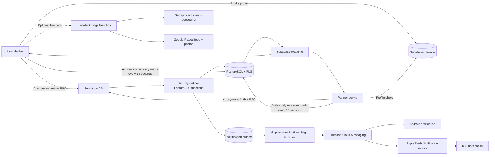
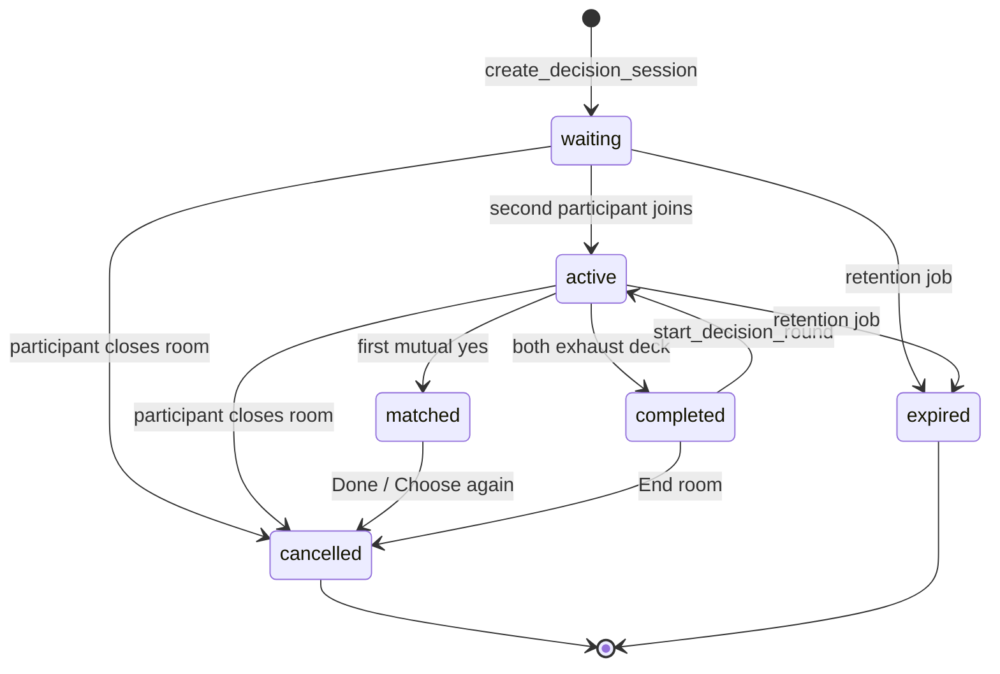

# Choosr Platform

Choosr is a private, real-time mobile decision app for exactly two people. Both participants
swipe independently through the same ordered choices, individual rejections remain private,
and Choosr reveals only the first option both people accept.

The MVP supports three creation modes:

1. **Pick an activity** — enter a U.S. ZIP code or Canadian postal code and build a deck from
   real nearby activities.
2. **Pick food** — use the same location flow to discover nearby restaurants.
3. **Create your own** — title a private room, add two to ten photos from the library or
   camera, and label each photo before inviting the other participant.

Users can invite an existing **Choosr Circle** connection or create a profile-free **Quick
Room** and share a one-time link. An eight-character room code is the recovery path. Active
rooms are persisted so a participant can leave and resume at the first unfinished choice.

Choosr is a React Native Community CLI application with standard native iOS and Android
projects. It does **not** use Expo, Expo Go, EAS, or an Expo runtime.

This README is the working product and engineering source of truth, including the MVP product
definition, lifecycle rules, architecture, security model, environment strategy, CI/CD flow,
and physical-device UAT requirements.

> **Product promise:** Stop debating. Swipe separately. Match together.

## Product principles

- **Private by default:** passes remain private, rooms expire, and location is collected only
  for the current room.
- **Agreement is the event:** PostgreSQL—not either phone—creates the authoritative match.
- **Low friction:** anonymous Supabase Auth provides a secure identity without a registration
  form; Circle is an optional repeat-use layer.
- **Server authority:** authenticated RPCs and Row Level Security control rooms, membership,
  swipes, matches, notifications, media ownership, and Circle relationships.
- **Cross-platform equality:** iPhone and Android use the same backend state and match rules.
- **Graceful presentation:** missing provider artwork falls back to a branded card instead of
  breaking the room.

## Engineering status

The real two-device client flow is implemented:

- Invisible, persisted anonymous authentication
- Server-generated private rooms and unambiguous room codes
- Exactly one host and one partner per room
- One immutable, ordered decision deck shared by both people
- Private, persisted left/right decisions
- Database-authoritative mutual matches and no-match outcomes
- Screen-scoped Supabase Realtime with a 15-second recovery poll
- Background-aware synchronization and one-minute presence heartbeats
- Database-scheduled room and inactive anonymous-user retention
- Reconnection-safe deck resumption from persisted swipe state
- Synchronized subsequent rounds
- Native invitation sharing and key-free Maps handoff
- Optional persistent **Choosr Circle** profiles and mutually accepted connections
- Native profile-photo selection with owner-scoped Supabase Storage uploads
- One-tap room invitations for Circle connections
- Contact-safe Circle links through the native share picker without address-book uploads
- Native Firebase Messaging permissions, iOS/Android FCM token lifecycle, startup token
  reconciliation, live unread state, and notification routing
- Transactional push outbox with leased, retryable FCM/APNs Edge delivery
- Live nearby Activity and Food decks with five-card Google restaurant discovery, ratings,
  cuisine details, venue photos, and provider attribution
- Labeled custom photo rooms with library and camera capture
- Private, owner-scoped decision-photo storage with signed cross-device URLs
- Active-room history and resume behavior
- Persistent notification inbox with read/delete state and native badge reconciliation
- Circle connection removal without deleting accounts or historical rooms

The repository currently declares 138 pgTAP assertions across schema, RLS, room flow, modes,
retention, Circle, invitations, notification delivery and inbox state, synchronized closure,
profile photos, custom-decision storage, Circle removal, and WebP support. Jest covers the
client domain and service boundaries. Pull requests also compile Android production-debug and
an unsigned iOS Production simulator build when shared or native code changes.

Delivery follows `feature/fix branch -> dev -> uat -> prod -> main`. The `dev`, `uat`, and
`main` branches deploy to their isolated GitHub Environments; `prod` is a release-review branch
and intentionally does not deploy. Signed mobile builds are uploaded to the matching Google
Play and App Store Connect records. Public release is still a deliberate store-console action.
Firebase App Distribution is not the primary installation channel.

### Current capability matrix

| Capability                                        | Status                        | Notes                                            |
| ------------------------------------------------- | ----------------------------- | ------------------------------------------------ |
| Activity and Food rooms                           | Implemented                   | Live server-side nearby discovery                |
| Cross-platform private swiping and matching       | Implemented                   | PostgreSQL is authoritative                      |
| Circle profiles, handles, connections, and photos | Implemented                   | Optional layer over anonymous Auth               |
| Quick-room links and manual codes                 | Implemented                   | Custom `choosr://` links; code is recovery       |
| Push invitations                                  | Implemented and device-tested | Firebase HTTP v1; FCM to Android and APNs to iOS |
| Synchronized round restart and room closure       | Implemented                   | Either participant can act; all clients follow   |
| Labeled custom photo decks                        | Implemented                   | Two to ten photos; private Storage               |
| Active Rooms and resume                           | Implemented in Dev            | Promotion and physical UAT remain                |
| Circle member removal                             | Implemented in Dev            | Preserves accounts and historical rooms          |
| Notification management and app badges            | Implemented in Dev            | Promotion and physical UAT remain                |
| HTTPS universal/app links and install landing     | Not implemented               | Required before polished external distribution   |
| Public production release                         | Not ready                     | Store, privacy, abuse, and operations remain     |

## Technology stack

| Layer                  | Technology                            | Responsibility                                                                |
| ---------------------- | ------------------------------------- | ----------------------------------------------------------------------------- |
| Mobile runtime         | React Native 0.86, React 19.2         | Shared application and UI runtime for iOS and Android                         |
| Language               | TypeScript 5.8                        | Domain types, navigation contracts, services, and screens                     |
| Native projects        | Xcode/CocoaPods and Gradle/Kotlin     | Standard iOS and Android builds, signing, icons, and platform configuration   |
| Navigation             | React Navigation native stack         | Typed screen flow and native navigation transitions                           |
| Interaction            | Gesture Handler, Reanimated, Worklets | Swipe gestures and match animations                                           |
| Device storage         | AsyncStorage                          | Persists the anonymous Supabase session across launches                       |
| Backend client         | Supabase JS                           | Auth, PostgREST reads, RPC writes, Realtime, and Edge Function calls          |
| Identity               | Supabase anonymous Auth + Circle      | Instant use plus an optional persistent name, handle, and photo               |
| Database               | PostgreSQL with Row Level Security    | Rooms, Circle connections, invitations, private swipes, and matches           |
| Media                  | Supabase Storage + Image Picker       | Owner-scoped Circle profile-photo selection and delivery                      |
| Write boundary         | PostgreSQL security-definer RPCs      | Validated, transactional state changes without direct table writes            |
| Live updates           | Supabase Realtime/Postgres Changes    | Room activation, participant, match, and round notifications                  |
| Recovery               | 15-second active-only polling         | Low-traffic fallback for missed or disconnected Realtime events               |
| Scheduled retention    | Supabase Cron / `pg_cron`             | Hourly room cleanup and daily inactive anonymous-user cleanup                 |
| Push client            | React Native Firebase + Kotlin bridge | Native permission, real FCM tokens, token rotation, and badge synchronization |
| Push delivery          | FCM HTTP v1 + APNs                    | Cross-platform delivery through a leased transactional outbox worker          |
| Provider boundary      | Supabase Edge Functions               | Keeps Geoapify and Google credentials out of mobile binaries                  |
| Nearby providers       | Geoapify + Google Places API (New)    | Activity/location lookup plus photo-rich five-card Food results               |
| Zero-key local handoff | Google Maps HTTPS search URLs         | Opens nearby results after a cuisine or activity match                        |
| App tests              | Jest, React Test Renderer             | Domain, parser, room-state, navigation-root, and deck behavior                |
| Database tests         | pgTAP, Supabase CLI                   | Schema, RLS, grants, validation, two-person flow, and atomic matching         |
| Code quality           | ESLint, Prettier, TypeScript          | Static analysis, formatting, and compile-time verification                    |

## System architecture



The mobile client is untrusted. It may read only data allowed by RLS and cannot directly
insert, update, or delete application-table rows. All writes cross validated, authenticated
database-function boundaries through RPCs.

### Authoritative room state



## Choosr Circle and invitations

Circle is the primary repeat-use path. A user creates a display name, unique handle, and
optional profile photo on top of the existing persisted anonymous identity. Connections are
mutual and server-authorized. **Quick room** remains the profile-free guest/onboarding path,
while **Enter code** is the recovery path when an invite link or notification is unavailable.

Profile photos are optional. The native picker scales the image to at most 1024×1024,
compresses it, and uploads only JPEG/PNG data up to 5 MB. Circle renders an initial when a
photo is absent or cannot be loaded. A photo is presentation data, not authentication.

There are two connection paths:

1. **Handle:** request `@handle`; the recipient explicitly accepts.
2. **Contacts:** Choosr creates a one-use, seven-day `choosr://connect/<token>` capability and
   opens the native share picker. The recipient becomes connected only after opening the link
   and creating a Circle identity. Choosr never reads or uploads the address book.

From Circle, selecting an accepted person before Watch/Eat/Do creates the normal secure room
and a recipient-bound `room_invitations` row. It appears in the other person's Circle and can
only be accepted by that authenticated recipient. A transactionally inserted
`notification_outbox` row is leased by the `dispatch-notifications` Edge Function and sent
through FCM HTTP v1. FCM delivers Android notifications directly and relays iOS notifications
through APNs. Room creation never depends on either push vendor being available: a failed send
remains retryable in the outbox and the in-app invitation remains authoritative. The client
also subscribes to inbox changes and reconciles the bell and native app-icon badge at startup
and whenever the app returns to the foreground.

## End-to-end room lifecycle

### 1. Host creates a room

1. The host selects Watch, Eat, or Do.
2. Eat and Do optionally collect a city, neighborhood, or postal code.
3. `WaitingScreen` builds the current normalized deck.
4. `ensureAnonymousSession()` restores or creates an anonymous Supabase identity.
5. `create_decision_session` validates the complete deck in PostgreSQL.
6. The database creates the session, host participant, and ordered `session_items` rows in
   one transaction.
7. The database returns the room UUID, eight-character code, one-time invite token, and
   expiration timestamp.
8. For a Circle room, the database creates a recipient-bound invitation and transactional
   push job. For a Quick room, **Send invite** opens the native share sheet with a tokenized
   room link and manual-code fallback for Messages, WhatsApp, and other installed apps.
9. The UI remains in the waiting state with one participant. There is no local timer or
   simulated partner.

### 2. Partner joins

1. A different device accepts a Circle invitation, opens a tokenized Quick-room link, or
   enters the room code.
2. The second device receives its own anonymous identity.
3. `join_session` locks and validates the room.
4. The function rejects expired, active, full, invalid, and third-participant joins.
5. The database inserts the unique `partner` role and changes the room from `waiting` to
   `active`.
6. Realtime or the polling fallback refreshes the host screen.
7. The host is shown **Partner joined** only when the database reports `active` and exactly
   two participant rows exist.

An installed app can instead open `choosr://join/<invite-token>`. The Join screen exchanges
that capability token for room membership and skips manual entry. The database stores only
the SHA-256 token hash. A future `https://join.choosr.app/...` universal/app-link gateway can
add App Store, Play Store, and browser fallbacks without changing the room or participant
model. The current MVP intentionally caps rooms at two; future groups can reuse the same
room-link boundary with capacity, invite-use, and participant-role migrations.

The scalable identity is therefore the room, not a phone-to-phone pairing: every device
independently presents a room-scoped invitation, joins through the server, and receives its
own participant row. Moving from couples to groups changes capacity and completion policy
(for example, unanimous versus majority matches), not the native linking architecture.

### 3. Both people swipe privately

1. Each client loads the same `session_items` snapshot, ordered by `position`.
2. Each client reads only its own previously persisted swipe IDs.
3. Reopened sessions resume at the first item without a stored swipe.
4. Every decision calls `submit_swipe`; the mobile app never writes `swipes` directly.
5. A participant cannot change an already submitted decision.
6. The partner cannot query the other person's swipe rows because of RLS.

### 4. The database resolves the outcome

`submit_swipe` locks the session and resolves the result atomically:

- **next:** this participant has more items.
- **waiting:** this participant finished but the other person has not.
- **match:** both participants accepted the same item; one unique match is persisted.
- **no-match:** both participants exhausted the deck without a mutual acceptance.

Both devices listen for session and match changes. If a WebSocket event is missed, the
polling fallback reads the authoritative state and navigates to the same outcome. A match
is terminal for the round: both clients automatically stop swiping, reveal the same final
pick, and offer the relevant nearby Maps completion action.

### 5. Another round

After a no-match result, either participant can call `start_decision_round`. The database
increments the round under a session lock, freezes the next deck, and returns the room to
`active`. The other client follows automatically through Realtime or polling. The current
fallback implementation reuses the previous normalized deck; provider-backed fresh-deck
generation is a remaining integration task.

### 6. Room closure

Either participant may close a waiting, active, matched, or completed room. `cancel_session`
validates membership, changes the server state to `cancelled`, cancels pending invitations,
and is idempotent for already closed rooms. Match, no-match, swipe, and waiting screens
observe the terminal state through Realtime or recovery polling and return to Home without
waiting for local input on the second device.

## Client architecture

### Navigation

The typed stack lives in `src/navigation/AppNavigator.tsx` and
`src/types/navigation.ts`:

```text
Home
├── Circle → Person → ModeSelect
├── Quick room → ModeSelect (profile-free guest flow)
│   ├── Waiting (Watch)
│   └── LocalSetup → Waiting (Eat/Do)
└── Enter code (invite recovery)

Waiting / Join → Swipe ┬→ Match → Done / Choose again
                       └→ NoMatch → next round / End room
```

Room-bound navigation parameters always include the server session ID and round number.
The client does not infer room identity from a local singleton.

### Service boundaries

- `src/lib/supabase.ts` constructs the single configured Supabase client and manages token
  auto-refresh with React Native app state.
- `src/services/anonymousAuth.ts` owns invisible session restoration and creation.
- `src/services/sessionService.ts` is the room persistence boundary: room RPCs, allowed
  reads, presence touches, and Realtime channel lifecycle.
- `src/hooks/useRoomSync.ts` centralizes screen-scoped subscriptions, slow fallback polling,
  presence cadence, and background/foreground behavior.
- `src/services/roomFlow.ts` contains pure room-state routing, reconnection indexing, code
  normalization, and safe user-facing error mapping.
- `src/services/deckService.ts` contains preview and provider-backed deck access.
- `src/services/circleService.ts` owns Circle profiles, connections, and invitations.
- `src/services/profilePhotoService.ts` owns native image selection, bounded encoding,
  Storage upload, profile binding, and replacement cleanup.
- `src/services/pushNotifications.ts` owns native permission, installation registration,
  foreground handling, and delivery-worker wakeups. iOS uses the React Native Firebase token
  bridge; Android uses `ChoosrPushRegistrationModule` to register the real FCM token rather
  than incorrectly treating the Firebase Installation ID as a deliverable push token.
- `src/services/decisionItemParser.ts` validates untrusted JSON loaded from PostgreSQL.
- `src/data/decisions.ts` defines decision modes and deterministic curated decks.

Screens coordinate rendering and user actions; authorization, persistence, outcome logic,
and provider normalization remain outside presentation components.

### Reconnection behavior

AsyncStorage persists the Supabase anonymous session. On entry to `SwipeScreen`, the app
loads three pieces of server state in parallel:

1. The immutable deck for the current round
2. The current participant's own submitted item IDs
3. The authoritative session/match outcome

The first unswiped item becomes the current card. If all local decisions are already
stored, the app renders a waiting state until the room becomes matched or completed.

## Database model

| Table                 | Purpose                                             | Important constraints                                     |
| --------------------- | --------------------------------------------------- | --------------------------------------------------------- |
| `sessions`            | Room mode, state, host, round, code, and expiration | Unique code/token hash; bounded state and mode            |
| `participants`        | Anonymous identities in a room                      | Unique user per room; unique host and partner roles       |
| `session_items`       | Frozen normalized deck for a round                  | Unique item and position per room/round                   |
| `swipes`              | Private participant decisions                       | Immutable participant/round/item decision                 |
| `matches`             | Authoritative mutual acceptance                     | At most one match per session                             |
| `profiles`            | Optional Circle identity                            | Unique handle; bounded display name; optional avatar path |
| `connections`         | Mutual Circle relationship                          | One record per unordered user pair                        |
| `circle_invites`      | Shareable connection capability                     | Hashed one-use token with seven-day expiration            |
| `room_invitations`    | Circle room invitation                              | One recipient-bound invitation per room                   |
| `device_push_tokens`  | Native delivery endpoints                           | Unique platform token/FID registration                    |
| `notification_outbox` | Transactional push work                             | Unique dedupe key, attempts, lease, and delivery state    |

`private.anonymous_user_activity` is a server-only retention ledger. It prevents an active
Circle or room identity from being deleted merely because its Auth creation date is old.

The normalized `DecisionItem` payload is stored with each room item so both devices see
the same title, metadata, tags, colors, action URL, and ordering even if a provider changes
later.

## Database functions

| Function                        | Responsibility                                                        |
| ------------------------------- | --------------------------------------------------------------------- |
| `validate_decision_deck`        | Bounds payload size/count and validates every normalized item         |
| `create_decision_session`       | Creates room, host, code/token, and first frozen deck                 |
| `join_session`                  | Atomically admits only the second participant                         |
| `touch_presence`                | Updates the current participant's `last_seen_at`                      |
| `submit_swipe`                  | Persists an immutable decision and resolves match/no-match atomically |
| `start_decision_round`          | Creates a synchronized next round after completion                    |
| `cancel_session`                | Lets either participant idempotently close any live/result room       |
| `upsert_choosr_profile`         | Creates or updates a display name and unique handle                   |
| `set_profile_avatar`            | Binds only the caller's validated Storage path                        |
| `send_connection_request`       | Creates a mutual-acceptance Circle request                            |
| `create_circle_invite`          | Creates a one-use, seven-day connection capability                    |
| `invite_connection_to_session`  | Creates a recipient-bound room invite and transactional push job      |
| `respond_room_invitation`       | Accepts or declines only for the bound recipient                      |
| `register_push_token`           | Stores the caller's current iOS token or Android FID                  |
| `claim_notification_jobs`       | Leases outbox work with `FOR UPDATE SKIP LOCKED`                      |
| `cleanup_expired_sessions`      | Marks expired rooms and deletes old expired data                      |
| `cleanup_stale_anonymous_users` | Removes identities inactive for 30 days, excluding live rooms         |

Mutating RPCs use `security definer` with an empty search path, explicitly authenticate
`auth.uid()`, validate membership and input, and acquire row/advisory locks where needed.

## Security and privacy model

- Users see no account UI, but every installation has a real anonymous Auth identity.
- Only the Supabase URL and publishable key may exist in the mobile environment.
- `.env`, generated environment modules, provider secrets, signing files, and service-role
  keys are ignored and must never be committed.
- RLS is enabled on every client-facing application table; direct writes are revoked.
- Authenticated clients have no direct `INSERT`, `UPDATE`, or `DELETE` grants.
- Profile photos are capped at 5 MB; Storage policies limit writes and deletion to the
  authenticated user's own folder. Public photo URLs are intentional because avatars are
  presentation data shown to Circle connections.
- Session membership gates room, participant, deck, and match reads.
- Swipe reads are restricted to the participant who created them.
- Invite tokens are returned once and only SHA-256 hashes are stored.
- Manual room codes use an unambiguous 32-character alphabet and carry 40 bits of entropy.
- Room creation is limited to 20 rooms per identity per rolling 24 hours.
- Rooms expire after 24 hours by default.
- Provider credentials remain server-side as Supabase Edge Function secrets.
- Persisted action URLs must use HTTPS.

Supabase Cron runs room cleanup hourly and inactive anonymous-user cleanup daily. A private
activity ledger prevents the blanket age-based deletion recommended for disposable accounts
from removing a long-lived Choosr user who recently used the app. Before a public launch,
enable CAPTCHA/abuse controls for anonymous sign-in and manual-code joining, configure usage
alerts, and complete a formal privacy review.

## Content and provider strategy

`supabase/functions/build-deck` is the protected live-provider boundary for Activity and Food:

- The host supplies a valid U.S. ZIP code or Canadian postal code.
- Geoapify validates/geocodes the location and finds nearby activities within a bounded radius.
- Google Places API (New) finds five nearby restaurants for Food rooms.
- Food cards include cuisine/type, rating and review count, distance, address, Google venue
  imagery when available, visible attribution, and a Google Maps action.
- Activity decks remain configurable up to twenty choices; Food decks are hard-capped at five.
- Provider credentials remain server-side and are never mobile environment values.
- A match carries a Google Maps HTTPS action for the final real-world handoff.
- Google photo media is resolved server-side without copying Google content into Supabase
  Storage. Activity results may retain a cached server-generated location image fallback.
  Provider keys never appear in returned image URLs.

Custom rooms use a room title and two to ten individually labeled photos. Photos may come from
the device library or camera. They are normalized on-device, written to the private
owner-scoped `decision-photos` bucket, and frozen into the room deck as signed HTTPS URLs. A
failed batch cleans up files uploaded by that attempt.

## Repository map

```text
choosr-platform/
├── App.tsx                         # Native app root and providers
├── src/
│   ├── components/                 # Shared UI, artwork, avatars, and swipe card
│   ├── data/                       # Decision modes and curated decks
│   ├── lib/                        # Supabase client configuration
│   ├── navigation/                 # Typed native-stack navigator
│   ├── screens/                    # Host, join, swipe, match, and no-match UI
│   ├── services/                   # Auth, rooms, Circle, photos, push, deck, and flow logic
│   ├── theme.ts                    # Shared visual tokens
│   └── types/                      # Domain, database, and navigation contracts
├── ios/                            # Native Xcode workspace/project and assets
├── android/                        # Native Gradle project and adaptive assets
├── supabase/
│   ├── migrations/                 # Versioned PostgreSQL source of truth
│   ├── tests/database/             # pgTAP security and lifecycle tests
│   ├── functions/build-deck/       # Protected provider adapters
│   ├── functions/dispatch-notifications/ # FCM HTTP v1 outbox worker
│   └── config.toml                 # Local Supabase configuration
├── __tests__/                      # Jest application tests
├── assets/brand/                   # App-icon master assets and rules
├── docs/                           # Product, engineering, and visual direction
├── .github/workflows/              # CI, native build, and guarded deployment automation
└── scripts/                        # Environment, Firebase distribution, and Play delivery tools
```

## Requirements

- macOS for iOS development
- Node.js 24 (`.nvmrc` is included; React Native requires Node 22.11 or newer)
- npm
- Xcode and CocoaPods
- Android Studio, Android SDK, and Java 21
- Docker Desktop for local Supabase
- Supabase CLI access for hosted deployment

## Initial setup

```sh
git clone git@github.com:pa-mi-su/choosr-platform.git
cd choosr-platform
nvm use
npm install
cp .env.dev.example .env.dev
cd ios
pod install
cd ..
```

Add only the mobile-safe hosted values to `.env.dev`:

```dotenv
SUPABASE_URL=https://YOUR_PROJECT_REF.supabase.co
SUPABASE_PUBLISHABLE_KEY=sb_publishable_...
```

`npm start`, `npm run ios`, and `npm run android` use development by default. Explicit scripts
are available as `npm run ios:dev`, `ios:uat`, `ios:prod`, `android:dev`, `android:uat`, and
`android:prod`. The generator reads `.env.dev`, `.env.uat`, or `.env.prod`; `.env` remains only
as a temporary development compatibility fallback. It writes the validated result to ignored,
mode-`0600` `src/config/generatedEnv.ts`.

### Configuration ownership

| Value/file                          | Where it belongs                                     | Safe to commit? |
| ----------------------------------- | ---------------------------------------------------- | --------------- |
| Supabase URL and publishable key    | Local `.env.<environment>`; generated config ignored | No              |
| Firebase Android client config      | Matching GitHub Environment; materialized by CI      | No              |
| Firebase iOS client config          | Matching GitHub Environment; materialized by CI      | No              |
| APNs `AuthKey_*.p8`                 | GitHub environment secret; uploaded to Firebase      | Never           |
| Firebase Admin service-account JSON | GitHub environment secret only                       | Never           |
| `FIREBASE_SERVICE_ACCOUNT_BASE64`   | GitHub secret synced to Supabase by CI               | Never           |
| Geoapify credentials                | GitHub secrets synced to Supabase by CI              | Never           |
| Google Places server key            | GitHub secrets synced to Supabase by CI              | Never           |
| Supabase service-role key           | Supabase-hosted server environment only              | Never           |

The deployed database migrations create all application tables, RPCs, Realtime publication
entries, Cron jobs, notification outbox boundaries, and the `profile-photos` Storage bucket.
Dashboard-only schema changes are not part of the supported workflow.

### Firebase client configuration

Development and UAT use `android/app/src/<environment>/google-services.json` and
`ios/Choosr/Firebase/<environment>/GoogleService-Info.plist`. CI materializes them from the
matching GitHub Environment. Production uses the corresponding production destinations.

The Apple APNs `.p8` key, Firebase service-account JSON, Android keystores, and signing
certificates are GitHub Environment secrets. They must not persist in the repository, Downloads,
a developer's persistent login Keychain, or project-specific local credential folders. CI may
import signing material only into a temporary runner keychain under `$RUNNER_TEMP`, which is
destroyed with the runner. Ignore rules remain a second line of defense, not approved storage.

Android enables Firebase's FID-based registration with
`firebase_messaging_installation_id_enabled`. The small Kotlin module under
`android/app/src/main/java/com/pamisu/choosr/push` calls the native `register()` API and returns
the registered FID to the existing Supabase device-registration boundary. Do not replace this
with the deprecated Android `getToken()` path.

## Run the mobile app

Start Metro:

```sh
npm start
```

Then, in another terminal:

```sh
npm run ios
npm run android
```

These aliases launch the development variants. Use `npm run ios:prod` or
`npm run android:prod` for the existing production-identifier test configuration while the
isolated lower environments are being provisioned.

For a physical iPhone, open `ios/Choosr.xcworkspace`, select the Choosr target, choose an
Apple development team under Signing & Capabilities, select the connected phone, and run.
Open the workspace—not the `.xcodeproj`—because CocoaPods dependencies are workspace-owned.
After adding or changing a native dependency, run `cd ios && pod install` and rebuild the app;
a Metro refresh cannot add a native module to an already installed binary.

Two-device testing requires separate application storage/anonymous identities. A simulator
and a physical iPhone, two simulators with separate data, or iOS and Android are valid
pairings. Entering a host's code on the same anonymous identity is intentionally rejected by
the UI.

## Local Supabase development

Docker Desktop is required. Local Supabase development credentials are public defaults,
and services may bind to all network interfaces. Use them only on a trusted network and
stop the stack after testing.

```sh
npm run supabase:start
npm run supabase:reset
npm run supabase:lint
npm run supabase:test
npm run supabase:stop
```

Local Supabase runs database migrations and tests without app secrets. Provider-backed decks and
push delivery are tested against the hosted Dev environment. GitHub Actions synchronizes the
Firebase, Geoapify, and Google Places credentials into Supabase before deploying the Edge
Functions.

`.env.dev` should use `http://127.0.0.1:54321` for simulators. A physical phone must use the
Mac's private Wi-Fi address instead (for example, `http://192.168.x.x:54321`) and both devices
must be on the same trusted network. The environment generator permits private HTTP URLs only
for Dev; UAT and Production continue to require hosted Supabase HTTPS URLs.

`supabase db reset --local` recreates the database, applies every migration, and seeds the
empty development seed. Database schema changes must be made as new migrations; do not make
dashboard-only production schema changes.

## Verification

Run the complete application checks:

```sh
npm run typecheck
npm run lint
npm test -- --runInBand
npm audit --audit-level=high
```

With local Supabase running:

```sh
npm run supabase:reset
npm run supabase:lint
npm run supabase:test
```

Native build verification:

```sh
cd android
ANDROID_HOME=/absolute/path/to/Android/sdk \
ANDROID_SDK_ROOT=/absolute/path/to/Android/sdk \
./gradlew assembleDebug
```

```sh
xcodebuild \
  -workspace ios/Choosr.xcworkspace \
  -scheme Choosr \
  -configuration Debug \
  -sdk iphonesimulator \
  -destination 'platform=iOS Simulator,name=iPhone 17 Pro' \
  CODE_SIGNING_ALLOWED=NO \
  build
```

## Hosted Supabase deployment

Database changes are forward-only, versioned migrations. Never edit or remove an applied
migration; correct it with a new compensating migration. Use this workflow for future
migrations and for linking a fresh engineering checkout.

Authenticate and link the CLI to the intended project:

```sh
npx supabase login
npx supabase projects list
npx supabase link --project-ref YOUR_PROJECT_REF
npx supabase migration list
```

Review and deploy migrations:

```sh
npx supabase db push --dry-run
npx supabase db push
```

Provider secrets and Edge Functions are deployed by the environment-gated GitHub Actions
workflow. Do not run `supabase secrets set` with literal values from a workstation. Geoapify is
required for hosted location validation and Activity discovery; Google Places API (New) is
required for Food discovery. Neither provider blocks database migrations, push delivery, or
mobile distribution.

```sh
gh secret set FIREBASE_SERVICE_ACCOUNT_BASE64 --env dev
gh workflow run supabase-deploy.yml --ref dev
```

### Push delivery deployment

1. In Firebase Console, open **Project settings → Cloud Messaging**, choose the Choosr iOS
   app, and upload the APNs authentication `.p8` with its Apple Key ID and Team ID.
2. In **Project settings → Service accounts**, generate a Firebase Admin SDK private key,
   upload its base64 value directly to the matching GitHub environment secret, verify it exists,
   and delete the downloaded file.
3. Trigger the environment-gated Supabase workflow. It applies versioned migrations, synchronizes
   `FIREBASE_SERVICE_ACCOUNT_BASE64`, and deploys `dispatch-notifications`.

The dispatcher uses the hosted `SUPABASE_SERVICE_ROLE_KEY` injected by Supabase, leases jobs
with `FOR UPDATE SKIP LOCKED`, removes invalid device tokens, marks a job delivered only after
at least one device accepts it, and releases failures for retry. Neither server credential is
bundled in the app.

Never paste a database password, access token, provider credential, secret key, or
service-role key into `.env`, source code, documentation, issues, or commit history.

After deployment, verify:

1. Anonymous sign-ins are enabled.
2. The project URL in `.env` resolves and matches the linked project.
3. The migration appears in `supabase migration list` for both local and remote.
4. Realtime publication includes `sessions`, `participants`, and `matches`.
5. One device remains waiting until a second distinct device joins.
6. A third identity is rejected.
7. Both devices receive the same ordered deck.
8. Individual swipe rows remain private.
9. Mutual acceptance opens the same match on both devices.
10. Done/End room on one device returns the other device to Home.
11. Circle invitations arrive in-app and by push on physical iOS and Android devices.
12. Profile-photo upload, replacement, initials fallback, and cross-device display work.

## Common troubleshooting

### Metro says `EADDRINUSE` on port 8081

Another Metro server may already be running. Confirm it belongs to this repository before
starting another process:

```sh
curl http://127.0.0.1:8081/status
lsof -nP -iTCP:8081 -sTCP:LISTEN
```

`packager-status:running` plus a process rooted in this repository means Metro is ready.

### Android cannot find the SDK

Set `ANDROID_HOME` and `ANDROID_SDK_ROOT` to the installed SDK path or add an ignored
`android/local.properties` containing the correct `sdk.dir`.

### iOS builds the wrong project

Use `ios/Choosr.xcworkspace`. The `.xcodeproj` does not include the installed Pods graph.

### Room creation shows a network error

Confirm that:

- `.env` contains the current hosted URL and publishable key.
- The hostname resolves from the device's network.
- Anonymous Auth is enabled.
- The migration has been deployed.
- The project is healthy and not paused.

### Push registration or delivery fails

The earlier Android `INVALID_ARGUMENT` registration problem was resolved by resetting the
test device's Google Play Services/Google Services Framework identity and signing in again.
Cross-platform push delivery now works on the physical acceptance devices.

For a new device, confirm that the installed package and Firebase registration both use
`com.pamisu.choosr`, notification permission is granted, Google Play Services is healthy,
the APNs key is attached to the current Firebase iOS app, and the hosted dispatcher still has
`FIREBASE_SERVICE_ACCOUNT_BASE64`. Capture filtered device logs before changing API-key
restrictions or replacing the supported FCM registration path.

## Current limitations and release blockers

- The Dev bug sweep still requires promotion and cross-platform physical-device UAT.
- Rooms support exactly two participants; group semantics are outside the current MVP.
- Circle identities are anonymous-session backed; durable account upgrade, recovery, and
  cross-device identity linking are not yet exposed.
- A branded HTTPS universal/app-link gateway and hosted install fallback page remain; the
  installed-app `choosr://` room/Circle links and manual-code fallback are implemented.
- Background push, APNs/FCM credentials, native registration, the database outbox, and the
  delivery worker are implemented and have passed cross-platform physical-device delivery.
- Manual-code join abuse controls and anonymous Auth CAPTCHA are required before launch.
- A complete iPhone/iPhone, Android/Android, and cross-platform acceptance matrix remains,
  including labeled photo rooms, image fallbacks, offline recovery, token rotation, Circle
  removal, room resumption, notification management, and expiration.
- Geoapify and Google Places quotas, terms, attribution, licensing, cost alerts, and
  production fallback behavior
  require final review.
- Final store metadata, declarations, screenshots, privacy/terms pages, crash reporting,
  production observability, support procedures, accessibility review, and store review remain.

## Product and engineering documents

- This README — current implemented product and technical source of truth
- `docs/PRODUCT_CHARTER.md` — earlier product-direction snapshot retained for history
- `docs/ENGINEERING_AUDIT.md` — architecture, SOLID, security, and release audit
- `docs/VISUAL_DIRECTION.md` — brand references, palette, icon, and motion rules
- `docs/DEPLOYMENT_AND_PIPELINES.md` — promotion, environment secrets, release, and rollback
- `supabase/README.md` — backend security model and deployment checklist
- `assets/brand/README.md` — app-icon sources and export rules

## Application identifiers

- Development iOS/Android identifier: `com.pamisu.choosr.dev`
- UAT iOS/Android identifier: `com.pamisu.choosr.uat`
- Production iOS/Android identifier: `com.pamisu.choosr`
- Apple Developer App ID: `com.pamisu.choosr` with Push Notifications enabled
- Firebase and Supabase projects are isolated by environment and materialized from the matching
  GitHub Environment during CI. Credential-bearing project identifiers are not documented here.
