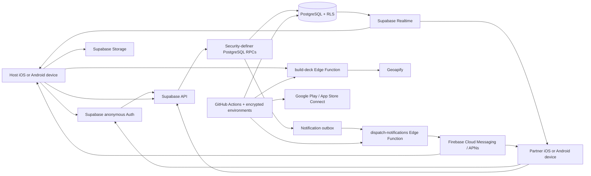

# Choosr MVP Product and Technical Charter

**Document status:** Current implementation baseline

**Last updated:** July 22, 2026

**Current Dev revision:** `b4b09440a98ea47615661d700728efec63f32311`

**Audience:** Product, engineering, operations, prospective partners, and UAT testers

---

## 1. Executive Summary

Choosr is a private, real-time mobile decision application for exactly two
people. It helps couples, friends, partners, and roommates decide what to do,
where to eat, or which custom option to choose without exposing every
individual rejection or creating an extended debate.

Both participants receive the same ordered deck of choices. They swipe
independently, and Choosr reveals only the first option both participants
accept. Individual passes remain private. The database, rather than either
phone, decides whether a match occurred.

The current MVP supports three creation modes:

1. **Pick an activity** — enter a U.S. ZIP code or Canadian postal code and
   receive up to ten real nearby activities.
2. **Pick food** — enter a U.S. ZIP code or Canadian postal code and receive up
   to ten real nearby restaurants.
3. **Create your own** — provide a prompt and create a private deck containing
   text choices, photos, or a mixture of both.

Choosr supports two invitation models:

- **Choosr Circle** is the repeat-use experience. A person creates an optional
  display identity, connects with someone, and sends recipient-bound room
  invitations with push and in-app notifications.
- **Quick Room** is the profile-free guest experience. The host shares a
  private one-time invitation link through the native share sheet. An
  eight-character room code is available as a recovery path.

Choosr is implemented as a React Native Community CLI application with normal
native iOS and Android projects. It does not depend on Expo, Expo Go, EAS, or
an Expo runtime. Its backend is Supabase Auth, PostgreSQL, Row Level Security,
Realtime, Storage, Cron, and Edge Functions. Firebase provides cross-platform
push transport. Geoapify provides server-side nearby place discovery.

> **Product promise:** Stop debating. Swipe separately. Match together.

---

## 2. Product Definition

### 2.1 The problem

Small decisions often create disproportionate friction. Two people can spend
more time browsing, rejecting suggestions, and defending preferences than they
spend enjoying the final choice.

Conventional recommendation tools show the same catalog but do not solve the
social negotiation problem. One person proposes an option, the other rejects
it, and the process repeats. Visible rejection can create pressure, compromise,
or decision fatigue.

### 2.2 The Choosr solution

Choosr separates preference collection from result disclosure:

- Both people receive the same choices in the same order.
- Each person accepts or passes privately.
- Neither participant can inspect the other person's swipe history.
- The first mutual acceptance becomes the shared result.
- The server persists and distributes the outcome to both phones.

Choosr is not trying to become a public polling network or a generic survey
builder. The MVP is a focused private coordination product: two known or newly
invited people reach one actionable decision quickly.

### 2.3 The core behavioral loop

1. Choose a decision mode.
2. Create a private room.
3. Invite one person.
4. Swipe independently.
5. Reveal a mutual match.
6. Act on the result or start another round.

The product is successful when this loop feels faster and more comfortable
than discussing every option manually.

---

## 3. Product Principles

### 3.1 Private by default

- Individual likes and passes are private.
- Only a mutual match is revealed.
- Rooms are temporary and expire automatically.
- Location is entered for the current room; Choosr does not maintain a
  permanent location profile.

### 3.2 Agreement is the event

The product celebrates agreement, not rejection. A mutual match is a durable,
server-created event shown consistently on both devices.

### 3.3 Low friction first

- Quick Rooms do not require a visible account-registration flow.
- Supabase anonymous authentication provides a secure identity invisibly.
- Circle is optional and accelerates repeat use.
- Invitation links are primary; room codes are a resilient fallback.

### 3.4 Server authority

Phones are untrusted clients. PostgreSQL validates room creation, membership,
swipes, matching, subsequent rounds, cancellation, notification state, and
Circle lifecycle.

### 3.5 Cross-platform equality

iPhone and Android participants use the same product contract, database state,
and match rules. Neither platform is a secondary client.

### 3.6 Graceful presentation

If an external place has no image or a remote image fails, the app presents a
branded fallback card rather than breaking the decision flow.

---

## 4. Audience, Jobs, and MVP Capacity

### 4.1 Primary users

- Couples deciding on an evening activity or restaurant
- Friends planning a local outing
- Roommates choosing food
- Two people comparing visual choices such as outfits, gifts, designs, or
  destinations
- Two people using different mobile platforms
- Guests who want to decide without creating a conventional account

### 4.2 Jobs to be done

- “Help us decide without arguing about every rejected option.”
- “Show us real nearby possibilities, not a generic list.”
- “Let me ask one person for help choosing between my own options or photos.”
- “Let me invite the same person again without copying another code.”
- “Let me leave and finish the room later.”

### 4.3 Current capacity boundary

The MVP supports exactly two participants:

- One host
- One partner

Group rooms, majority voting, rankings, public feeds, public polls, and open
community discovery are outside the current MVP.

The existing participant, invitation, room, and notification boundaries can be
extended later, but group semantics require explicit product decisions about
capacity, match thresholds, roles, completion, and privacy.

---

## 5. Current Decision Modes

### 5.1 Pick an Activity

The host must enter a valid five-digit U.S. ZIP code, ZIP+4, or Canadian postal
code. Choosr then invokes an authenticated Supabase Edge Function that:

1. Converts the postal code into coordinates through Geoapify geocoding.
2. Searches named entertainment and leisure locations within a configurable
   radius.
3. Biases results by proximity.
4. Returns up to ten normalized choices by default, bounded to a maximum of
   twenty by the provider adapter.
5. Attempts to retrieve a remote image through Geoapify place details.
6. Produces a Google Maps HTTPS action for the matched location.

The current search radius defaults to 15 km and is bounded between 500 metres
and 25 km. If fewer valid places are available, Choosr returns only the valid
results.

Each card can include:

- Place name
- Activity category
- Approximate distance
- Formatted address
- Remote image when the provider supplies one
- “Open in Maps” action after matching

### 5.2 Pick Food

Food uses the same location and security boundary as Activity, but searches
Geoapify restaurant categories. The result is a deck of real nearby restaurant
locations rather than generic cuisines.

Each card can include:

- Restaurant name
- Restaurant category
- Approximate distance
- Formatted address
- Remote image when available
- Google Maps action after matching

### 5.3 Create Your Own

Custom rooms let a host define the decision prompt and add between two and ten
total choices. A deck may contain:

- Text-only choices
- Photo-only choices
- A mixture of text and photo choices

Examples include:

- “What should I wear tonight?” with outfit photos
- “Which logo should we use?” with design images
- “Where should we travel?” with text or image options
- “Which gift should we buy?” with a mixed deck

Photos are normalized on the device, uploaded to the private
`decision-photos` Storage bucket, and represented in the immutable room deck by
HTTPS signed URLs. Partial upload failure triggers cleanup of files uploaded by
that attempt so an incomplete room is not silently created.

The room lasts 24 hours, while generated decision-photo URLs are valid for 48
hours. The URL lifetime therefore exceeds the room lifetime.

---

## 6. Identity and Invitation Models

### 6.1 Invisible anonymous identity

Every installation authenticates through Supabase anonymous Auth. The user does
not need to provide an email address, phone number, or password to use the core
Quick Room experience.

The persisted anonymous session gives the backend a stable authenticated UUID
for:

- Room ownership and membership
- Private swipe ownership
- Rate limiting
- Storage ownership
- Optional Circle identity
- Notification routing

This is meaningfully different from an unauthenticated device ID: the backend
can enforce authorization through `auth.uid()` and Row Level Security.

### 6.2 Choosr Circle

Circle is an optional social layer over the anonymous Auth identity. It
supports:

- Display name
- Unique normalized handle
- Optional profile photo
- Exact-handle connection request
- Incoming request acceptance or rejection
- One-time Circle connection link
- Accepted repeat-use relationships
- Recipient-bound room invitations
- Connection removal with confirmation

Removing a person from Circle:

- Changes the relationship to `removed`
- Cancels pending room invitations for that relationship
- Removes the person from both active Circle lists
- Does not delete either account
- Does not delete either profile
- Does not delete prior rooms, matches, or swipe history

A previously removed or declined relationship can later be re-requested.

### 6.3 Quick Room

Quick Room is for a new or occasional partner:

1. The host chooses Activity, Food, or Custom.
2. Choosr builds and freezes the decision deck.
3. The server creates a room, an eight-character code, and a one-time
   high-entropy invitation capability.
4. Only a SHA-256 hash of the invitation token is stored.
5. The host shares the invitation through the native share sheet.
6. The partner redeems the token and becomes the second participant.

A Quick Room does not create a Circle relationship automatically.

### 6.4 Enter Code recovery

The eight-character room code supports cases where:

- A deep link does not open correctly
- The link was copied to another device
- The participants are physically together
- A messaging channel strips the link
- The partner prefers to enter a code manually

Codes use an unambiguous base-32 alphabet and provide approximately 40 bits of
entropy. Public scale will require additional abuse controls around repeated
manual-code attempts.

---

## 7. Room and Matching Lifecycle

### 7.1 Room creation

The server creates:

- A UUID room identifier
- An unambiguous eight-character access code
- A one-time invitation token
- A hash of that token
- A host participant record
- An immutable ordered snapshot of the complete decision deck
- A 24-hour expiration time

An anonymous identity is limited to twenty room creations in a rolling 24-hour
period.

### 7.2 Room states

| State       | Meaning                                                  |
| ----------- | -------------------------------------------------------- |
| `waiting`   | The host created the room and the partner has not joined |
| `active`    | Exactly two participants are admitted and can swipe      |
| `matched`   | The server created a mutual match                        |
| `completed` | Both participants exhausted the deck without a match     |
| `cancelled` | Either participant ended the room                        |
| `expired`   | The retention boundary ended the room                    |

### 7.3 Private swiping

1. Both devices load the same frozen `session_items` ordered by position.
2. Each device reads only that participant's existing swipes.
3. A reopened active room resumes at the first unswiped item.
4. Each choice calls the `submit_swipe` database RPC.
5. Clients cannot insert into the `swipes` table directly.
6. A participant cannot read the other participant's individual decisions.

### 7.4 Authoritative outcome resolution

`submit_swipe` stores an immutable decision and returns one of four outcomes:

- `next` — the participant has more choices
- `waiting` — the participant finished before the partner
- `match` — both participants accepted the same item
- `no-match` — both participants exhausted the deck

The function locks the session row while resolving the outcome. Database
constraints and locking prevent duplicate matches, conflicting terminal states,
and client-manufactured results.

### 7.5 Match and next round

When a match occurs:

1. PostgreSQL persists one authoritative match.
2. The room becomes `matched`.
3. Realtime notifies both devices.
4. Both clients reload the persisted result.
5. The matched Activity or Food card can open Google Maps.
6. Either participant can finish or initiate another synchronized round.

If no match occurs, both devices receive the no-match state. Either participant
may start another synchronized round or end the room.

### 7.6 Realtime and recovery

Supabase Realtime is a notification mechanism, not the source of truth. Active
room screens subscribe to relevant PostgreSQL changes and also use a 15-second
recovery poll. A one-minute presence heartbeat supports current-room state.

If Realtime misses an event or the app returns from the background, the client
reloads authoritative state from PostgreSQL.

---

## 8. Active Rooms and Continuity

The Home screen exposes **Continue active rooms**. The Active Rooms screen
loads up to thirty recent member-visible rooms and organizes them into:

- Active
- Completed
- Expired or cancelled

For active swipe sessions, the user can reopen the room and continue at the
first unfinished choice. The screen also exposes waiting-room status, code,
choice progress, and historical terminal states.

Room continuity is derived from persisted database state; it does not depend
on an in-memory navigation stack surviving.

---

## 9. Notifications and Native Badges

### 9.1 Notification sources

The current notification types are:

- Circle connection request
- Circle room invitation

Product actions write to a transactional PostgreSQL outbox. A private Supabase
Edge Function leases pending jobs, sends them through Firebase Cloud Messaging,
records success or retryable failure, and removes invalid device tokens when
appropriate.

### 9.2 Delivery path

- Android receives FCM delivery directly.
- iOS receives APNs delivery relayed through Firebase.
- Push payloads include the recipient's authoritative unread count.
- Android notification count and iOS APNs `badge` synchronize the app icon.
- Foreground and notification-open handling route users back into Choosr.

### 9.3 In-app inbox

The notification center supports:

- Unread count on the Home-screen bell
- Persistent read state
- Swipe action to mark an item read
- Swipe action to delete an item
- Mark all read
- Clear all with confirmation
- Soft deletion rather than physical destruction of the audit row
- Native app-icon badge reconciliation after read/delete operations

Notification reads and deletes are recipient-scoped database functions. A user
cannot manage another user's inbox.

---

## 10. Photo and Artwork Pipeline

### 10.1 Shared native picker boundary

Profile photos and Custom decision photos use a shared preparation service that:

- Opens the native iOS or Android photo library
- Requests compatible image representations
- Resizes images to a bounded maximum dimension
- Applies 0.8 quality during picker conversion
- Decodes bytes before upload
- Identifies the actual file format from magic bytes rather than trusting the
  filename alone
- Accepts JPEG, PNG, and WebP
- Rejects unsupported or oversized files

The compatible representation mode addresses iPhone HEIC/asset conversion
issues by requesting upload-compatible media from the native picker.

### 10.2 Profile photos

- Maximum prepared size: 5 MB
- Maximum picker dimension: 1024×1024
- Owner-scoped Storage path
- Profile path validated against the authenticated user's UUID
- Previous avatar removed after successful replacement
- Public presentation URL for Circle rendering
- Initials fallback when absent or unavailable

### 10.3 Custom decision photos

- Maximum prepared size: 8 MB per image
- Maximum picker dimension: 1600×1600
- Up to ten total text/photo choices
- Private `decision-photos` bucket
- Owner-scoped insert, select, and delete policies
- Signed HTTPS URL embedded in the frozen room deck
- Cleanup of partially uploaded batches on error

### 10.4 Cross-device rendering

Decision artwork retries a failed remote image once with a cache-busting query
and reload cache policy. If the second attempt fails, Choosr displays branded
generated artwork with the same title and metadata instead of leaving a broken
image surface.

---

## 11. Current Application Screens

| Screen        | Current responsibility                                                                             |
| ------------- | -------------------------------------------------------------------------------------------------- |
| Home          | Product value statement, notifications, Circle entry, Active Rooms, Quick Room, and Enter Code     |
| Notifications | Persistent inbox, mark-read, delete, clear-all, and badge reconciliation                           |
| Circle        | Profile, avatar, push opt-in, connections, removal, connection links, and pending room invitations |
| Mode Select   | Pick Activity, Pick Food, or Create Your Own                                                       |
| Local Setup   | Require and validate a U.S. ZIP or Canadian postal code                                            |
| Custom Setup  | Define a prompt and create text, photo, or mixed choices                                           |
| Waiting       | Build the deck, create the room, invite a partner, display code, and wait for readiness            |
| Join          | Redeem a one-time invitation token or submit a room code                                           |
| Active Rooms  | Display active/completed/expired rooms and resume active swipe sessions                            |
| Swipe         | Render the frozen deck and submit private decisions                                                |
| Match         | Display the shared result, provider action, repeat-round action, or completion action              |
| No Match      | Start a synchronized next round or end the room                                                    |

---

## 12. Technology Stack

| Layer                | Technology                                   | Responsibility                                               |
| -------------------- | -------------------------------------------- | ------------------------------------------------------------ |
| Mobile runtime       | React Native 0.86 and React 19.2             | Shared iOS and Android application runtime                   |
| Language             | TypeScript 5.8                               | Domain, navigation, service, and UI contracts                |
| iOS                  | Xcode 26.3, Swift, CocoaPods                 | Native build, signing, APNs, Firebase, and image selection   |
| Android              | Gradle, Kotlin, Java 21                      | Native build, product flavors, Firebase bridge, and signing  |
| Navigation           | React Navigation native stack                | Typed screen and deep-link flow                              |
| Interaction          | Gesture Handler, Reanimated, Worklets        | Swipe input and animation                                    |
| Local persistence    | AsyncStorage                                 | Anonymous session and local preference persistence           |
| Backend client       | Supabase JavaScript client                   | Auth, RPC, RLS reads, Realtime, Storage, and Functions       |
| Identity             | Supabase anonymous Auth                      | Invisible authenticated identity                             |
| Database             | PostgreSQL                                   | Authoritative application and relationship state             |
| Authorization        | Row Level Security and security-definer RPCs | Member reads and validated writes                            |
| Live synchronization | Supabase Realtime                            | Room, participant, match, round, and closure signals         |
| Media                | Supabase Storage                             | Profile and decision photos                                  |
| Nearby discovery     | Geoapify                                     | Geocoding, nearby places, details, and optional images       |
| Result handoff       | Google Maps HTTPS actions                    | Open the matched venue externally                            |
| Push client          | React Native Firebase and Notifee            | Permissions, tokens, routing, inbox, and badges              |
| Push server          | Firebase HTTP v1 and APNs                    | Cross-platform background delivery                           |
| Server functions     | Supabase Edge Functions                      | Nearby-deck creation and push dispatch                       |
| Scheduled work       | Supabase Cron / `pg_cron`                    | Room, Circle-artifact, and inactive-user cleanup             |
| App tests            | Jest and React Native Testing Library        | Client and service regression coverage                       |
| Database tests       | Supabase CLI and pgTAP                       | Schema, RLS, lifecycle, and transactional behavior           |
| Delivery             | GitHub Actions and GitHub Environments       | Validation, backend deploy, native signing, and store upload |

---

## 13. System Architecture



### 13.1 Trust boundary

The mobile client can:

- Authenticate anonymously
- Read rows permitted by RLS
- Call approved RPCs
- Subscribe to approved Realtime tables
- Upload media to its own Storage folder
- Invoke authenticated Edge Functions

The mobile client cannot:

- Write application tables directly
- Create its own match
- Add a third room participant
- Read another participant's swipes
- Accept an invitation bound to another identity
- Bind another user's avatar path
- Read service-role, provider, store, or signing credentials

---

## 14. Data Model

### 14.1 Public application tables

| Table                 | Purpose                                                           |
| --------------------- | ----------------------------------------------------------------- |
| `sessions`            | Room owner, code, token hash, mode, status, round, and expiration |
| `participants`        | Exactly-two membership, role, join time, and presence             |
| `session_items`       | Immutable normalized deck snapshot per room round                 |
| `swipes`              | Private immutable participant decisions                           |
| `matches`             | One authoritative mutual result per room                          |
| `profiles`            | Optional Circle display name, handle, and avatar path             |
| `connections`         | Pending, accepted, declined, and removed Circle lifecycle         |
| `circle_invites`      | One-use connection capabilities                                   |
| `room_invitations`    | Recipient-bound room invitation lifecycle                         |
| `device_push_tokens`  | iOS/Android notification endpoints                                |
| `notification_outbox` | Transactional leased push-delivery jobs                           |
| `user_notifications`  | Persistent recipient inbox with read and soft-delete state        |

### 14.2 Private data

`private.anonymous_user_activity` records relevant recent activity for
retention decisions. It protects active anonymous identities from being removed
solely because their Auth account was created long ago.

### 14.3 Storage buckets

| Bucket            | Visibility                        | Limit | Purpose             |
| ----------------- | --------------------------------- | ----: | ------------------- |
| `profile-photos`  | Public presentation, owner writes |  5 MB | Circle avatars      |
| `decision-photos` | Private, owner-scoped             |  8 MB | Custom room choices |

---

## 15. Important Database Functions

### 15.1 Room lifecycle

- `validate_decision_deck`
- `create_decision_session`
- `join_session`
- `touch_presence`
- `submit_swipe`
- `start_decision_round`
- `cancel_session`
- `cleanup_expired_sessions`

### 15.2 Circle and profiles

- `upsert_choosr_profile`
- `get_choosr_profile`
- `set_profile_avatar`
- `send_connection_request`
- `respond_connection`
- `remove_circle_connection`
- `create_circle_invite`
- `redeem_circle_invite`
- `list_circle`

### 15.3 Invitations and notifications

- `invite_connection_to_session`
- `list_pending_room_invitations`
- `respond_room_invitation`
- `register_push_token`
- `claim_notification_jobs`
- `complete_notification_job`
- `fail_notification_job`
- `mark_notifications_read`
- `delete_notifications`
- `unread_notification_count`

### 15.4 Retention

- `cleanup_stale_anonymous_users`
- `cleanup_circle_artifacts`

Mutating functions authenticate `auth.uid()`, validate inputs, use an empty
search path, and expose only the minimum result required by the client. Critical
matching operations use row locks and uniqueness constraints.

---

## 16. Security and Privacy Posture

### 16.1 Authorization

- RLS is enabled on client-facing application tables.
- Authenticated clients have read access only where a policy permits it.
- Direct client writes to core tables are revoked.
- Mutations occur through reviewed database functions.
- Swipes are visible only to the participant who created them.
- Room reads require membership.
- Room invitation acceptance requires the bound recipient.
- Storage writes are scoped to the authenticated user's UUID folder.

### 16.2 Credential handling

- Mobile binaries contain only the environment's Supabase URL and publishable
  key, plus the normal platform Firebase client configuration.
- Supabase service-role credentials do not enter the app.
- Firebase Admin, Geoapify, Google Play, APNs, Apple distribution, and App
  Store Connect credentials are GitHub Environment secrets.
- Credential files are materialized only on an ephemeral GitHub runner.
- iOS code signing imports the certificate into a temporary runner-only
  keychain under `$RUNNER_TEMP`; nothing is written to a developer's persistent
  login Keychain by CI.
- Credential files are not committed to Git.
- Automated secret verification checks the repository during CI.

### 16.3 Input and deck validation

The database validates:

- Supported mode
- JSON array structure
- Payload byte size
- Deck size
- Unique item identifiers
- Required text fields and length bounds
- Six-digit color values
- HTTPS-only image and action URLs
- Tag count and length
- Mode consistency across all items

### 16.4 Privacy characteristics

- No address-book upload
- No mandatory email, telephone number, or password
- No permanent location profile
- No visibility into another participant's individual rejections
- Temporary room lifetime
- Historical relationship removal without destructive account deletion

Before a public launch, anonymous authentication should also be protected by
CAPTCHA/abuse controls appropriate to Supabase anonymous sign-in.

---

## 17. Retention and Account Lifecycle

### 17.1 Rooms

- Rooms expire after 24 hours.
- Scheduled cleanup owns expiration and room-artifact retention.
- Either participant can explicitly cancel a room.
- Realtime propagates synchronized closure to both clients.

### 17.2 Circle relationships

Relationship states are:

- `pending`
- `accepted`
- `declined`
- `removed`

Declined and removed records remain available for lifecycle/audit behavior but
do not appear as usable Circle relationships.

### 17.3 Accounts during UAT

- **Active:** normal Supabase Auth identity and optional profile.
- **Suspended:** managed by an authorized operator through Supabase Auth.
- **Deleted:** explicit administrative action governed by foreign-key and
  retention rules.

Choosr does not currently expose destructive account administration in the
mobile application. During UAT, suspension and deletion are performed through
the environment's Supabase dashboard by an authorized administrator.

---

## 18. Environment Architecture

Choosr maintains separate mobile identities, Firebase applications, backend
projects, and store listings for Dev, UAT, and Production.

| Environment | Android package         | iOS bundle ID           | Git branch that deploys it | Purpose                                          |
| ----------- | ----------------------- | ----------------------- | -------------------------- | ------------------------------------------------ |
| Dev         | `com.pamisu.choosr.dev` | `com.pamisu.choosr.dev` | `dev`                      | Engineering integration and early device testing |
| UAT         | `com.pamisu.choosr.uat` | `com.pamisu.choosr.uat` | `uat`                      | Acceptance testing on isolated UAT data          |
| Production  | `com.pamisu.choosr`     | `com.pamisu.choosr`     | `main`                     | Store candidate and eventual public release      |

The `prod` branch is a release-review branch. It intentionally does not deploy.
Production deployment occurs only when the reviewed `prod` commit set is
merged into `main`.

Each binary is materialized with the matching:

- Supabase URL and publishable key
- Firebase Android/iOS client configuration
- Native application identifier
- Signing profile
- Store destination

A lower-environment binary must never point at the Production backend.

---

## 19. Branching and Promotion Model

Normal delivery follows:

```text
feature branch → dev → uat → prod → main
```

Recommended operating process:

1. Start a feature or fix branch from the current stable `main` baseline unless
   the work explicitly depends on unreleased Dev-only changes.
2. Open the feature PR into `dev`.
3. Require CI to pass and merge.
4. Dev automatically deploys its backend and builds/uploads its native apps
   when affected.
5. Open `dev → uat` and resolve promotion conflicts in the source branch.
6. Run the UAT checklist against the UAT backend and UAT applications.
7. Open `uat → prod` for final release review.
8. Open `prod → main` with the exact approved commit set.
9. `main` deploys Production and uploads private store candidates.
10. Public release remains a deliberate store-console decision.

Database migrations are forward-only. Applied migrations are never rewritten
or deleted; rollback is a new compensating migration.

---

## 20. CI/CD and Store Delivery

### 20.1 Pull-request validation

PRs into `dev`, `uat`, `prod`, or `main` run:

- Credential/secret hygiene check
- Environment-structure verification
- Prettier formatting check
- ESLint
- TypeScript compilation
- Jest application tests
- Local Supabase startup
- Full migration rebuild
- pgTAP database assertions
- Database lint
- Android production-debug compilation when Android/shared code changed
- iOS unsigned Production simulator build when iOS/shared code changed

Platform change detection avoids compiling native applications for unrelated
documentation-only changes.

### 20.2 Environment deployment

Pushes to `dev`, `uat`, and `main` can run environment-gated workflows.

The Supabase workflow:

1. Resolves branch to GitHub Environment.
2. Verifies deployment gates and credentials.
3. Links the correct Supabase project.
4. Previews database changes with a dry run.
5. Applies forward migrations.
6. Synchronizes Geoapify and Firebase Admin secrets.
7. Deploys `build-deck`.
8. Deploys `dispatch-notifications`.

The mobile workflow:

1. Resolves environment and native flavor/scheme.
2. Detects affected platforms.
3. Materializes environment configuration from GitHub.
4. Builds a signed Android App Bundle and/or iOS IPA.
5. Uploads a seven-day CI artifact for diagnostics.
6. Optionally distributes pre-release binaries through Firebase when its gate
   is enabled.
7. Uploads Android to the configured Google Play track when enabled.
8. Uploads iOS to App Store Connect when enabled.

The current operating choice is to use Google Play and App Store Connect as the
primary installation channels. Firebase App Distribution is gated and was
skipped in the latest verified Dev build.

### 20.3 Versioning

- `APP_VERSION` is the human-readable version.
- `github.run_number` supplies a monotonically increasing native build number.
- Android receives the CI run number as `versionCode`.
- iOS receives the CI run number as `CURRENT_PROJECT_VERSION` during export.

### 20.4 Latest verified Dev delivery

At revision `b4b09440a98ea47615661d700728efec63f32311`:

- Supabase credential validation passed.
- Database dry run passed.
- Database migrations applied.
- `build-deck` deployed with the Dev Geoapify secret.
- `dispatch-notifications` deployed.
- Signed Android Dev build completed and uploaded to Google Play.
- Signed iOS Dev IPA completed and uploaded to App Store Connect.
- Firebase App Distribution was skipped by configuration.

This verifies the Dev deployment mechanics. The same commit still requires
promotion to UAT and physical-device acceptance before the bug sweep is UAT
approved.

---

## 21. Automated Quality Baseline

### 21.1 Database coverage

The repository currently declares **135 pgTAP assertions** across ten database
test files. Coverage includes:

- Schema and RLS structure
- Grants and direct-write revocation
- Host/partner flow
- Third-user rejection
- Private swipe visibility
- Atomic authoritative match creation
- Decision modes and deck validation
- Retention and Cron registration
- Circle profiles and connections
- Room invitations
- Push delivery leases and retry state
- Synchronized room closure
- Profile-photo ownership
- Notification inbox behavior
- Custom decision storage
- Circle removal
- Notification soft deletion
- WebP avatar support

### 21.2 Application coverage

The Jest suite covers:

- Root application rendering
- Decision-mode definitions
- Decision-item runtime parsing
- Room-flow helpers
- Invitation-link construction and parsing
- Match-result action safety
- Photo format detection, normalization, and user-facing errors

The PR that introduced the UAT bug sweep passed all required GitHub checks:

- TypeScript and application tests
- Supabase migration and pgTAP tests
- Android production-debug build
- iOS Production simulator build
- Affected-platform detection

The supported CI runtime is Node 22. Local commands should use the repository's
declared Node requirement (`>=22.11.0`) to match CI behavior.

---

## 22. Current MVP Capability Matrix

| Capability                        | Status             | Notes                                            |
| --------------------------------- | ------------------ | ------------------------------------------------ |
| Invisible authenticated guest use | Implemented        | Supabase anonymous Auth                          |
| Two-person private rooms          | Implemented        | Exactly one host and one partner                 |
| Pick an Activity                  | Implemented        | Live Geoapify postal-code discovery              |
| Pick Food                         | Implemented        | Live nearby restaurant discovery                 |
| Custom text choices               | Implemented        | Two to ten total choices                         |
| Custom photo choices              | Implemented        | JPEG, PNG, WebP; private Storage                 |
| Mixed text/photo custom rooms     | Implemented        | Partial upload cleanup included                  |
| Private swipes                    | Implemented        | Other participant cannot read them               |
| Authoritative matching            | Implemented        | PostgreSQL transaction and lock                  |
| Realtime synchronization          | Implemented        | With polling recovery                            |
| Synchronized next round           | Implemented        | Database-owned round number                      |
| Synchronized cancellation         | Implemented        | Either participant can end room                  |
| Quick invitation link             | Implemented        | One-time high-entropy token                      |
| Manual room code                  | Implemented        | Eight unambiguous characters                     |
| Circle profiles and handles       | Implemented        | Optional social identity                         |
| Circle profile photos             | Implemented        | Shared normalized upload pipeline                |
| Circle requests and acceptance    | Implemented        | Push plus in-app record                          |
| Circle member removal             | Implemented in Dev | History preserved; promote to UAT                |
| Active Rooms                      | Implemented in Dev | Resume active swipe sessions                     |
| Persistent notification inbox     | Implemented        | Read state and soft deletion                     |
| Notification swipe actions        | Implemented in Dev | Read and delete actions                          |
| Native app-icon badges            | Implemented in Dev | FCM/APNs authoritative unread count              |
| Android environment builds        | Implemented        | Signed App Bundles and Play upload               |
| iOS environment builds            | Implemented        | Signed IPA and App Store upload                  |
| Separated Dev/UAT/Prod apps       | Implemented        | Unique packages, bundle IDs, and backends        |
| Internal administration UI        | Not implemented    | Supabase dashboard during UAT                    |
| Group rooms                       | Not implemented    | Future product expansion                         |
| Public production launch          | Not completed      | Store review/listing and release decision remain |

---

## 23. Known Boundaries and Remaining Risks

### 23.1 Product boundaries

- Rooms support exactly two people.
- Circle identities are installation/session-backed anonymous identities; full
  account recovery and cross-device identity linking are not yet exposed.
- Waiting rooms are shown in room history, but resumption is currently focused
  on active swipe sessions.
- Notification taxonomy currently covers connection requests and room
  invitations.

### 23.2 Discovery dependencies

- Activity and Food room creation requires the target environment's
  `GEOAPIFY_API_KEY` Edge Function secret.
- Provider image availability is not guaranteed; branded fallback artwork is
  intentional.
- Provider quotas, terms, attribution, and production monitoring must be
  reviewed before public scale.
- A hosted retry/monitor schedule for push delivery should be independently
  monitored before public launch.

### 23.3 Distribution boundaries

- Uploading a build to an internal Play track or App Store Connect does not
  make the app public.
- Google Play listing declarations, tester configuration, and review state can
  still control install availability.
- App Store Connect processing and TestFlight group assignment occur after
  upload.
- Public rollout remains manual and should follow UAT and Production smoke
  tests.

### 23.4 Operational gaps before public production

- Final privacy policy and terms URLs
- Final store descriptions, screenshots, categories, declarations, and review
  information
- Crash reporting and production observability decision
- CAPTCHA/rate limiting for anonymous-auth and manual-code abuse
- Formal support, suspension, deletion, and incident procedures
- Provider quota alerts and cost controls
- Public deep-link/universal-link landing experience
- Final accessibility and device-matrix review

---

## 24. UAT Acceptance Plan

The latest Dev revision should be promoted to UAT only after Dev smoke checks,
then validated on physical iPhone and Android devices.

### 24.1 Core room matrix

- iPhone host → iPhone partner
- Android host → Android partner
- iPhone host → Android partner
- Android host → iPhone partner
- Quick link join
- Manual code join
- Circle invitation join
- Third-user rejection
- Room expiration and cancellation
- Background/resume during swiping
- Reconnect after temporary network loss

### 24.2 Mode matrix

- Activity with U.S. ZIP
- Activity with Canadian postal code
- Food with U.S. ZIP
- Food with Canadian postal code
- Provider result with image
- Provider result without image
- Custom text-only room
- Custom photo-only room
- Custom mixed text/photo room
- Two choices and ten choices
- iPhone-originated photos rendered on Android
- Android-originated photos rendered on iPhone

### 24.3 Lifecycle matrix

- Add and accept Circle connection
- Remove Circle member from either side
- Verify both lists update
- Verify historical rooms remain
- Reconnect after removal
- Resume an unfinished active room
- Complete and classify a room
- Verify expired/cancelled display

### 24.4 Notification matrix

- Background connection-request push
- Background room-invitation push
- Foreground notification handling
- Notification-open routing
- iOS app-icon badge
- Android app-icon badge where launcher supports it
- Mark one read
- Swipe delete one
- Mark all read
- Clear all
- Restart app and verify persistence

---

## 25. Definition of MVP Done

The Choosr MVP is functionally complete for UAT when:

1. Activity, Food, and Custom rooms pass the cross-platform physical-device
   matrix.
2. A user can create, invite, swipe, match, repeat, cancel, and resume without
   inconsistent state.
3. Circle add/remove and history-preservation behavior passes acceptance.
4. Profile and decision photos upload and render cross-device.
5. Notifications and app-icon badges reconcile with persistent unread state.
6. All required CI checks pass at every promotion.
7. UAT backend and store builds use only UAT resources.
8. No credential is committed or stored in a developer's persistent Keychain
   for CI operation.
9. UAT sign-off identifies the exact Git SHA and native build numbers.

The MVP is ready for a public Production release only after the remaining
store, privacy, abuse-control, observability, and operational requirements are
completed.

---

## 26. Product Narrative for Stakeholders

### 26.1 Thirty-second explanation

Choosr helps two people make a decision without debating every rejection. One
person creates a private room for an activity, a restaurant, or their own text
and photo choices. Both people swipe independently through the same options.
Choosr keeps individual passes private and reveals the first choice they both
accept. It works across iPhone and Android, supports quick guest links or a
repeat-use Circle, and synchronizes the result in real time.

### 26.2 Technical explanation

Choosr is a cross-platform React Native application backed by a
server-authoritative Supabase architecture. Anonymous Auth gives every
installation an authenticated identity without a registration form.
PostgreSQL RLS restricts reads, while security-definer RPCs own all mutations.
Each room freezes one normalized deck for exactly two participants. Swipe
decisions are immutable and private, and `submit_swipe` atomically creates at
most one mutual match under a session lock. Realtime provides low-latency
updates, with polling recovery for missed events. Supabase Edge Functions keep
Geoapify and Firebase Admin credentials off devices. GitHub Environments
separate Dev, UAT, and Production credentials, native identifiers, signing, and
store delivery.

### 26.3 Why the architecture matters

The architecture protects the product promise. Privacy is not merely a UI
convention: another participant cannot query individual rejections. Agreement
is not guessed on a phone: the database creates it transactionally. Cross-device
media is not a local file reference: it is uploaded and delivered through
Storage. Environment separation is not a naming convention: each native app
has its own identifier, backend, Firebase configuration, signing target, and
store listing.

---

## 27. Near-Term Roadmap

### Immediate

1. Promote the current Dev revision to UAT.
2. Execute the physical-device UAT matrix.
3. Record defects against exact environment and build numbers.
4. Repair and repeat promotion without bypassing environment boundaries.

### Before public Production

1. Complete store metadata, declarations, screenshots, privacy policy, and
   terms.
2. Add production monitoring, crash reporting, provider quota alerts, and
   operational runbooks.
3. Add public-grade abuse protection for anonymous Auth and room-code attempts.
4. Complete universal/app-link and install-landing behavior.
5. Perform security, privacy, accessibility, and release-readiness reviews.

### After MVP validation

Potential expansions should be evaluated only after the two-person core loop
shows retention and repeat use:

- Durable account upgrade and cross-device identity recovery
- Private groups and configurable match rules
- Saved favorites and room history beyond the temporary decision window
- More provider categories and filters
- Internal administration and support tooling
- Recommendation personalization based on privacy-preserving aggregate signals

The immediate product priority remains making the private two-person decision
loop fast, reliable, understandable, and enjoyable.
